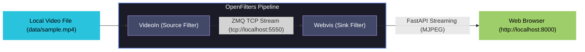

# 🎥 OpenFilters Webvis Proof-of-Concept (POC)

This workspace contains a clean, self-contained proof-of-concept setup for building and running an **OpenFilters** pipeline. It streams a local video file, processes it, and serves the frames via standard MJPEG multipart HTTP streaming to a browser-based visualization sink (**Webvis**).

---

## 📐 Pipeline Architecture

The pipeline consists of two primary filters linked in series:



- **VideoIn (`video_source`)**: Ingests video frames from `data/sample.mp4` and publishes them over ZeroMQ TCP stream at `tcp://*:5550` (or dynamic binding).
- **Webvis (`webvis_sink`)**: Subscribes to the upstream TCP frame stream, runs an embedded FastAPI server, and serves live video frames to connected browser clients on port `8000`.

---

## 📂 Folder Structure

```
OpenFilterWebvisTest/
├── .venv/               # Local Python 3.13 Virtual Environment
├── data/
│   └── sample.mp4       # Sample video file for testing
├── run_pipeline.py      # Python script to run the pipeline programmatically
└── README.md            # This documentation file
```

---

## 🛠️ Step-by-Step Setup

The environment has been pre-configured with Python 3.13 as required by `openfilter`'s dependency constraints.

### 1. Activate the Virtual Environment
To work within this workspace, first activate the virtual environment in your terminal:
```bash
source .venv/bin/activate
```

### 2. Dependencies Installed
The setup installs the local `openfilter` library in **editable mode** (`-e`) along with its extra dependencies (`video-in` and `webvis`):
```bash
pip install -e "/Users/lintly/git/Plainsight/Application/openfilter[video-in,webvis]" opencv-python
```

---

## 🚀 How to Run the Pipeline

You can run the pipeline using either the Python script or the OpenFilters CLI.

### Option A: Running via Python Script (Recommended)
This method executes the pipeline programmatically via the `Filter.run_multi()` API:

```bash
# Ensure virtual env is active
python run_pipeline.py
```

### Option B: Running via the OpenFilters CLI
You can also run the exact same pipeline using the `openfilter` CLI command:

```bash
# Ensure virtual env is active
openfilter run \
  - VideoIn \
    --sources "file://$(pwd)/data/sample.mp4!loop!sync" \
    --outputs "tcp://*:5550" \
  - Webvis \
    --sources "tcp://localhost:5550" \
    --port 8000
```

---

## 📺 Viewing the Output

Once either command is running:

1. Open your browser and navigate to **[http://localhost:8000](http://localhost:8000)**.
2. You will see the real-time, looped video stream playing smoothly.
3. To view raw frame metadata and JSON logging (if applicable), navigate to **[http://localhost:8000/data](http://localhost:8000/data)**.

---

## 🔍 Troubleshooting

> [!WARNING]
> **Port Already in Use (`OSError: [Errno 48] error while attempting to bind to iport`)**
> Make sure no other web servers or other pipeline instances are occupying port `8000` or `5550`. If needed, you can edit `run_pipeline.py` or adjust the CLI arguments to use a different port (e.g., `--port 8080`).

> [!IMPORTANT]
> **Video Stream is Stuttering or Slow**
> - The `!sync` modifier in the source URI ensures every frame is processed sequentially without dropping, which is ideal for accurate analysis but might run slower if CPU bottlenecked.
> - To allow real-time playback by skipping frames under lag, remove the `!sync` suffix from the source string.
